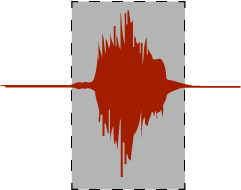

# **CARL: Computer-Assisted Response Labeler**
## **Overview**
--------



Computer-Assisted Response Labeler (CARL) is a MATLAB GUI tool that aims to speed-up manual labeling of short verbal responses. It has been particularly developed with the goal of speeding up the labeling of verbal recordings from psychological experiments.

It facilitates labeling by (a) splitting long recordings into word chunks (if not already provided by the user as separate words), (b) automatically pre-labeling word on- and offsets based on sound energy, (c) allowing quick manual refinement of sound on- and offsets via drag and drop, (d) providing a few options for label speed-up, e.g., auto-starting only the pre-labeled portions of the recording, (e) allows to manually split chunks containing multiple words into separate ‘trials’ or segments.

## **Documentation**
-------------

**Loading audio data**

To load audio data, .wav files can be directly read in. Alternatively, a structure can be directly provided. Both workflows are demonstrated in the ./util/example.m script.

**Splitting continuous recordings into individual words**

This optional step attempts to identify individual word chunks from a continuous recording (see example #2 in the ```example.m``` script).

**Pre-labeling individual word on-/offsets**

CARL has been designed to quickly label short voice recordings of single words. Pre-labeling uses sound energy properties to roughly estimate speech on- and offsets. Sensitivity can be adjusted via the ```threshold``` parameter.

**GUI usage**

A label for each trial can be entered in the lower right. Upon pressing enter, the GUI will advance to the next clip.

Dragging and dropping in the GUI alters the on-and offset window. Note that the shaded area cannot be edited directly, but will return an error. If selection within the grey area is necessary, drag a more extensive selection around it and then draw a refined selection within this larger edit.

Note that the sound volume of each clip will be normalized. Sound volume has to be adjusted in the OS, CARL has no volume adjustment option.

Once labeling is finished, the GUI can be closed. The output structure is automatically updated.

There are multiple buttons at the lower left:

* **Trial #** | Enter segment number here
* **Seperate** | Activate button and click where current segment should be split in two. Note that button remains active until unselected.
* **Last Clip** | Return to previous audio clip
* **Next Clip** | Advance to next audio clip
* **Play** | Play current audio clip (see *AutoStart* below to only play highlighted segmentation)
* **Stop** | Stop current audio clip
* **Shift -** | Append 100 ms prior to clip onset, if this includes parts of the prior clip, both will be merged *[Only works if a single pn.audioFile is specified!]*
* **Shift +** | Append 100 ms following clip onset, if this includes parts of the next clip, both will be merged *[Only works if a single pn.audioFile is specified!]*

There are three radio buttons at the lower right, if pressed the following activates (until unselected):

* **Auto: w** | automatically label next segment with a 'w' (may e.g., come in handy when there is an expected response)
* **Auto: /** | automatically label next segment with a '/' (may e.g., come in handy when there is no response)
* **AutoStart** | If active, the next segment will play when pressing play or advancing to the next segment. **If a segmentation is available, only the highlighted segment will play**. When AutoPlay is selected during segmentation, the selected segment will re-play once drag-and-drop is finished.

**Output structure**

Cell structure: 5 x trial #
* **Row 1**: audio amplitudes (by time)
* **Row 2**: time index w.r.t. original recording
* **Row 3**: clip duration (seconds)
* **Row 4**: manual label
* **Row 5**: on- and offset indices w.r.t. current clip 

## **Installation**
-------------

After downloading, add the toolbox path. The toolbox requires a version of MATLAB and has been tested with R2016b.

**Example files**

Example files can be downloaded via the ```get-example-data.sh``` script and should be placed in the ```util``` directory. If you want to clone this tool alongside example files, you can execute the following code:

```
git clone https://github.com/jkosciessa/carl.git
cd ./carl/util/
./get-example-data.sh
```

Example files have the following doi.

[](https://doi.org/10.5281/zenodo.7358140)

*Note: The example script starts by setting the relative path within MATLAB to the folder containing the current (example.m) script. Tis will only properly work if the script is run. To do so, but allow running the script line-by-line, set a breakpoint following the initial section and run the script.*

## **Credits**
-------------

Splitting of continuous recordings is partly adapted from [the silenceRemoval toolbox](http://www.mathworks.com/matlabcentral/fileexchange/28826-silence-removal-in-speech-signals/) by Theodoros Giannakopoulos.

## **License**
-------------

The CARL library is free software: you can redistribute it and/or modify it under the terms of the GNU General Public License as published by the Free Software Foundation, either version 3 of the License, or (at your option) any later version.

The CARL library is distributed in the hope that it will be useful, but WITHOUT ANY WARRANTY; without even the implied warranty of MERCHANTABILITY or FITNESS FOR A PARTICULAR PURPOSE.  See the GNU General Public License for more details.

The functions ```ShortTimeEnergy``` and ```SpectralCentroid``` are included under [the following licence](https://www.mathworks.com/matlabcentral/fileexchange/28826-silence-removal-in-speech-signals/#license_modal).

```

Copyright (c) , 
All rights reserved.

Redistribution and use in source and binary forms, with or without
modification, are permitted provided that the following conditions are
met:

    * Redistributions of source code must retain the above copyright
      notice, this list of conditions and the following disclaimer.
    * Redistributions in binary form must reproduce the above copyright
      notice, this list of conditions and the following disclaimer in
      the documentation and/or other materials provided with the distribution

THIS SOFTWARE IS PROVIDED BY THE COPYRIGHT HOLDERS AND CONTRIBUTORS "AS IS"
AND ANY EXPRESS OR IMPLIED WARRANTIES, INCLUDING, BUT NOT LIMITED TO, THE
IMPLIED WARRANTIES OF MERCHANTABILITY AND FITNESS FOR A PARTICULAR PURPOSE
ARE DISCLAIMED. IN NO EVENT SHALL THE COPYRIGHT OWNER OR CONTRIBUTORS BE
LIABLE FOR ANY DIRECT, INDIRECT, INCIDENTAL, SPECIAL, EXEMPLARY, OR
CONSEQUENTIAL DAMAGES (INCLUDING, BUT NOT LIMITED TO, PROCUREMENT OF
SUBSTITUTE GOODS OR SERVICES; LOSS OF USE, DATA, OR PROFITS; OR BUSINESS
INTERRUPTION) HOWEVER CAUSED AND ON ANY THEORY OF LIABILITY, WHETHER IN
CONTRACT, STRICT LIABILITY, OR TORT (INCLUDING NEGLIGENCE OR OTHERWISE)
ARISING IN ANY WAY OUT OF THE USE OF THIS SOFTWARE, EVEN IF ADVISED OF THE
POSSIBILITY OF SUCH DAMAGE.
```